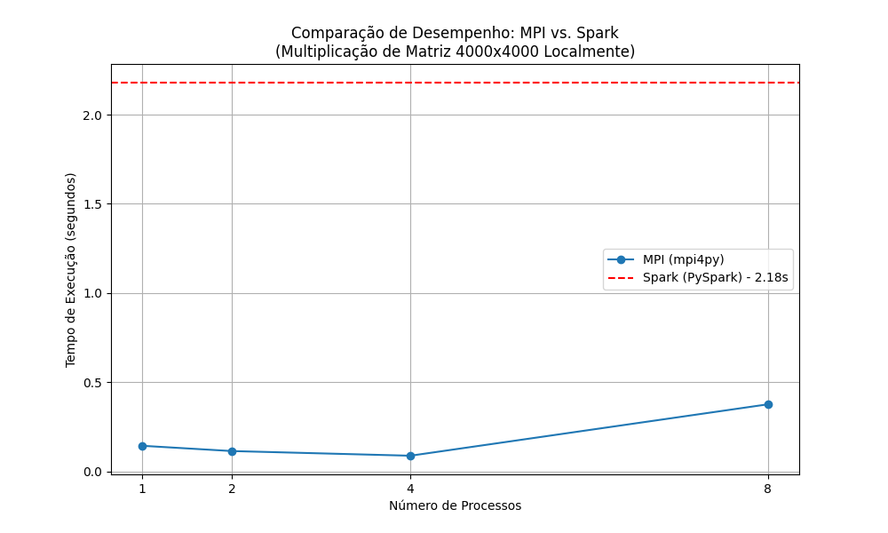
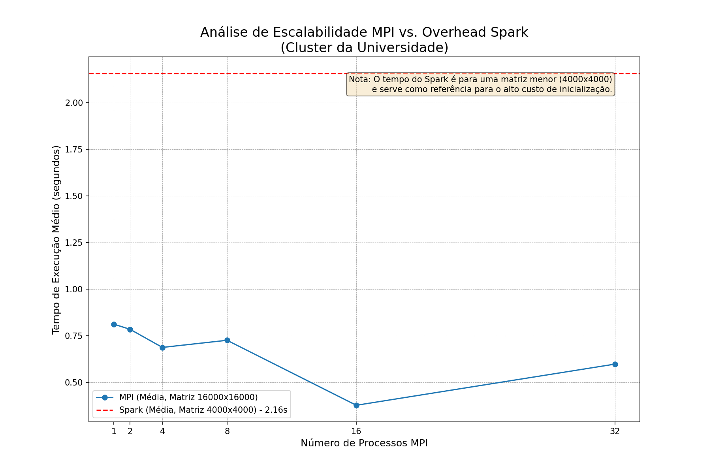
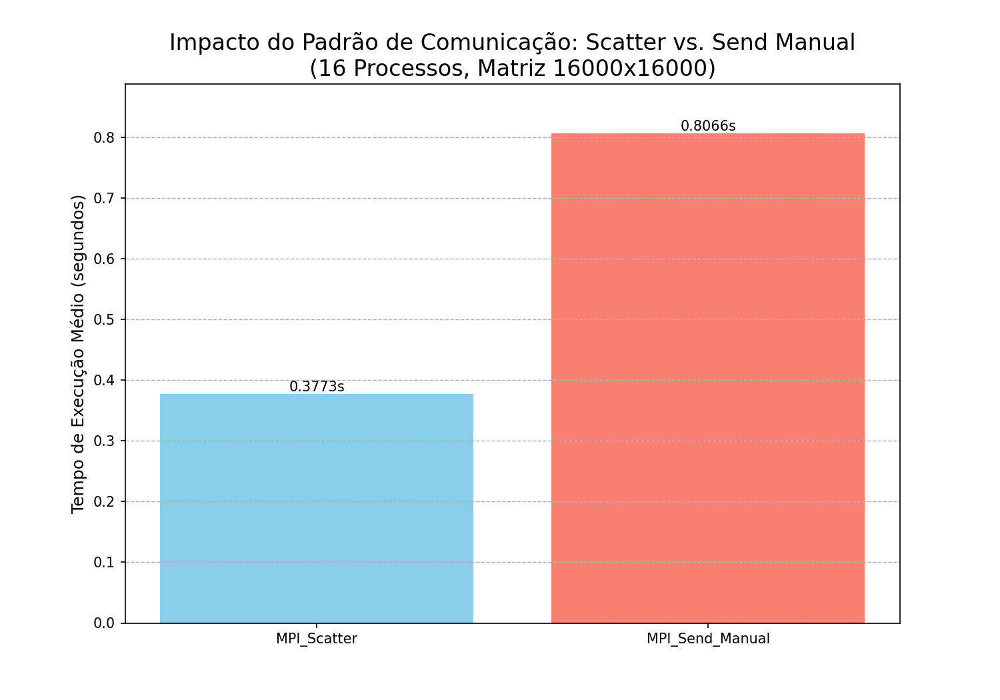
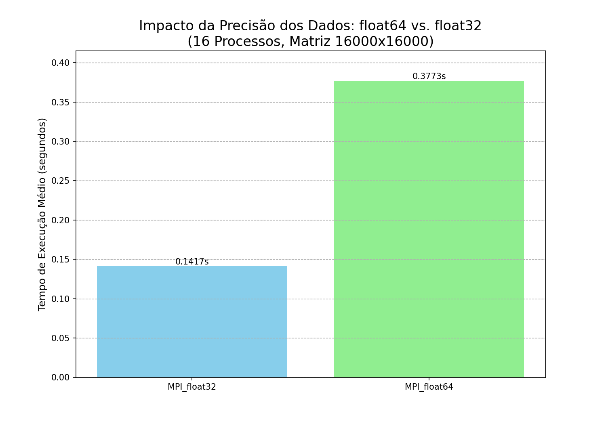
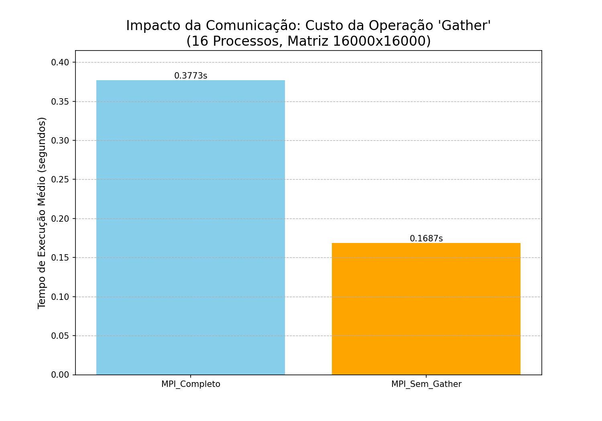

# Relatório de Análise de Desempenho: MPI vs. Spark

## Objetivo

O objetivo deste trabalho é realizar uma análise comparativa de desempenho entre duas tecnologias de computação paralela: MPI (Message Passing Interface), através da biblioteca `mpi4py`, e Apache Spark, através de `pyspark`. O problema base para a comparação é a multiplicação de matriz-vetor, um cálculo computacionalmente intensivo e altamente paralelizável. A análise foca em métricas de tempo de execução, escalabilidade e o impacto de diferentes fatores de otimização no desempenho.

## Fase 1: Testes Iniciais em Ambiente Local

A primeira fase do projeto foi realizada em uma máquina local para validar os algoritmos e estabelecer uma linha de base de comparação. Para estes testes, foi utilizada uma matriz de 4000x4000.

### Código-Fonte Inicial: Spark

O código abaixo foi utilizado para a implementação em Spark. Ele paraleliza as linhas da matriz em um RDD (Resilient Distributed Dataset) e utiliza a operação `broadcast` para distribuir o vetor de forma eficiente a todos os nós de trabalho.

```python
import sys
import time
import numpy as np
from pyspark.sql import SparkSession

def matrix_vector_multiplication(spark, matrix, vector_broadcast):
    matrix_rdd = spark.sparkContext.parallelize(matrix)
    def multiply_row(row):
        return np.dot(row, vector_broadcast.value)
    result_rdd = matrix_rdd.map(multiply_row)
    result_vector = result_rdd.collect()
    return result_vector

if __name__ == "__main__":
    MATRIX_SIZE = 4000

    spark = SparkSession.builder.appName("MatrixVectorMultiplication").getOrCreate()
    
    matrix_A = np.random.rand(MATRIX_SIZE, MATRIX_SIZE)
    vector_x = np.random.rand(MATRIX_SIZE)
    vector_x_broadcast = spark.sparkContext.broadcast(vector_x)

    start_time = time.time()
    result = matrix_vector_multiplication(spark, matrix_A, vector_x_broadcast)
    end_time = time.time()

    print(f"Tempo de execução: {end_time - start_time:.4f} segundos")

    spark.stop()
```

### Código-Fonte Inicial: MPI

A implementação em MPI utiliza primitivas de comunicação coletiva para distribuir o trabalho. O processo mestre (rank 0) inicializa os dados, utiliza `comm.Bcast` para enviar o vetor a todos os processos e `comm.Scatter` para distribuir as linhas da matriz. Ao final, `comm.Gather` é usado para coletar os resultados parciais.

```python
import sys
import time
import numpy as np
from mpi4py import MPI

comm = MPI.COMM_WORLD
rank = comm.Get_rank()
size = comm.Get_size()

MATRIX_SIZE = 4000

matrix_A = None
vector_x = None

if rank == 0:
    matrix_A = np.random.rand(MATRIX_SIZE, MATRIX_SIZE).astype('float64')
    vector_x = np.random.rand(MATRIX_SIZE).astype('float64')
    start_time = time.time()
else:
    start_time = None

if rank != 0:
    vector_x = np.empty(MATRIX_SIZE, dtype='float64')
comm.Bcast(vector_x, root=0)

rows_per_process = MATRIX_SIZE // size
local_matrix_rows = np.empty((rows_per_process, MATRIX_SIZE), dtype='float64')
comm.Scatter(matrix_A, local_matrix_rows, root=0)

local_result = np.dot(local_matrix_rows, vector_x)

full_result_vector = None
if rank == 0:
    full_result_vector = np.empty(MATRIX_SIZE, dtype='float64')

comm.Gather(local_result, full_result_vector, root=0)

if rank == 0:
    end_time = time.time()
    print(f"Tempo de execução: {end_time - start_time:.4f} segundos")
```

### Conclusão da Fase 1

Os testes locais revelaram uma disparidade de desempenho massiva. O MPI foi ordens de magnitude mais rápido que o Spark. A principal razão é o alto custo de inicialização (overhead) do Spark, que precisa gerenciar uma JVM (Java Virtual Machine). Para um problema que cabe inteiramente na memória e possui uma natureza puramente computacional, a abordagem de baixo nível do MPI se mostrou muito mais eficiente. Devido a este resultado, decidiu-se não prosseguir com testes de matrizes maiores para o Spark, pois a conclusão sobre seu alto overhead para este tipo de problema já estava clara.



## Fase 2: Análise de Escalabilidade em Cluster (UFF)

Com acesso a um cluster de alto desempenho da universidade, equipado com 32 threads, o foco do projeto mudou para uma análise de escalabilidade mais robusta. O tamanho do problema foi aumentado para uma matriz de **16000x16000** para desafiar o hardware e tornar os efeitos do paralelismo mais evidentes.

### Resultados da Escalabilidade

Os testes foram executados com 1, 2, 4, 8, 16 e 32 processos MPI. Os resultados mostraram um comportamento clássico de escalabilidade em HPC.



A análise do gráfico revela que o desempenho melhora significativamente até 16 processos, que corresponde ao número de núcleos físicos do nó do cluster. Ao utilizar 32 processos, forçando o uso de threads lógicas (Hyper-Threading), o desempenho degrada. Isso ocorre devido à competição por recursos no mesmo núcleo físico, gerando uma sobrecarga que supera os benefícios do paralelismo adicional para esta tarefa. O "ponto ideal" (sweet spot) de desempenho para este problema neste hardware foi de 16 processos.

## Fase 3: Análise de Fatores de Desempenho

Para aprofundar o entendimento, três experimentos controlados foram realizados, utilizando 16 processos como base de comparação.

### Alteração 1: Padrão de Comunicação

**Hipótese:** A primitiva coletiva `Scatter` é mais eficiente que uma distribuição manual via `Send` ponto a ponto.

**Modificação:** A operação `comm.Scatter` foi substituída por um laço `for` no processo mestre, que envia as porções da matriz sequencialmente para cada processo trabalhador.

```python
rows_per_process = MATRIX_SIZE // size

if rank == 0:
    for i in range(1, size):
        start_row = i * rows_per_process
        end_row = start_row + rows_per_process
        comm.Send(matrix_A[start_row:end_row, :], dest=i)
    local_matrix_rows = matrix_A[0:rows_per_process, :]
else:
    local_matrix_rows = np.empty((rows_per_process, MATRIX_SIZE), dtype='float64')
    comm.Recv(local_matrix_rows, source=0)
```

**Conclusão:** Os resultados confirmaram a hipótese. A versão com `Send` manual foi significativamente mais lenta, pois cria um gargalo de comunicação no processo mestre, que precisa atender a todos os outros sequencialmente. Isso demonstra a importância das primitivas coletivas otimizadas.



### Alteração 2: Granularidade dos Dados

**Hipótese:** Reduzir a precisão dos dados de `float64` (precisão dupla) para `float32` (precisão simples) melhorará o desempenho.

**Modificação:** Todas as declarações de arrays `numpy` no código MPI foram alteradas de `dtype='float64'` para `dtype='float32'`.

**Conclusão:** O tempo de execução foi notavelmente menor com `float32`. A razão é que o volume de dados transferido pela rede nas operações `Bcast` e `Scatter` foi reduzido pela metade. Isso ilustra um trade-off fundamental em computação científica: a troca de precisão numérica por velocidade, principalmente através da otimização da comunicação de dados.



### Alteração 3: Custo da Comunicação Final

**Hipótese:** A operação final de coleta de dados (`Gather`) possui um custo de tempo mensurável.

**Modificação:** A linha `comm.Gather(...)` foi comentada no código MPI. Uma `comm.Barrier()` foi adicionada antes da medição do tempo final para garantir que todos os processos tivessem concluído seus cálculos.

```python
local_result = np.dot(local_matrix_rows, vector_x)

comm.Barrier()

if rank == 0:
    end_time = time.time()
```

**Conclusão:** A versão sem `Gather` foi ligeiramente mais rápida. A diferença entre os tempos de execução das duas versões representa o custo líquido da comunicação para reunir os resultados. Embora o cálculo domine o tempo total, este experimento mostra que a comunicação de dados, mesmo no final, impõe um overhead que não é desprezível.



## Conclusão Geral do Projeto

Este trabalho demonstrou com sucesso as diferenças fundamentais entre MPI e Apache Spark, bem como os fatores que governam o desempenho em sistemas paralelos.

1.  **MPI vs. Spark:** Para problemas de computação numérica intensiva que cabem na memória (in-memory), o MPI oferece um desempenho e controle muito superiores devido à sua natureza de baixo nível e overhead mínimo. O Spark, por outro lado, é uma ferramenta de ecossistema de Big Data, cujo alto custo de inicialização não o torna competitivo neste cenário, mas que brilharia em tarefas com dados que excedem a RAM, exigindo tolerância a falhas e integração com outras ferramentas de dados.

2.  **Escalabilidade e Hardware:** A análise no cluster revelou que o desempenho não escala linearmente com o número de processos. Existe um ponto ótimo que geralmente corresponde ao número de núcleos físicos. Além desse ponto, a sobrecarga de comunicação e a competição por recursos podem degradar o desempenho, como visto no teste com 32 processos.

3.  **Otimização é Multifatorial:** Os experimentos de alteração provaram que o desempenho não depende apenas do poder de cálculo, mas também da eficiência dos padrões de comunicação (primitivas coletivas), do volume de dados transferidos (precisão) e do custo inerente a cada etapa de comunicação.

Em suma, a escolha da ferramenta e a otimização do código dependem intrinsecamente da natureza do problema, do volume dos dados e da arquitetura do hardware disponível.
